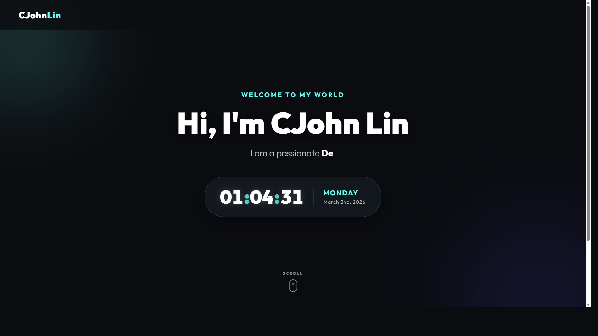

# CJohn Lin — Personal Portfolio

**[Live Demo](https://cjohnlin.github.io/0225_Lecture_1/)**



A clean, Apple-inspired single-page personal portfolio built with HTML, CSS, and vanilla JavaScript — no frameworks, no build steps.

## Features

- **Apple Design Language** — Light theme, SF Pro font stack, frosted glass navigation bar, and generous whitespace throughout.
- **Smooth Scroll Animations** — Sections and cards fade in with staggered reveal animations as you scroll.
- **Dynamic Typewriter** — Hero subtitle cycles through roles (Developer, Designer, Freelancer, Creator) with a realistic typing effect.
- **Live Clock Widget** — Glassmorphism card displaying local time to the second alongside today's date.
- **Multi-section Layout** — Hero, About, Skills, Projects, and Contact sections in a single scrollable page.
- **Responsive** — Fluid typography via `clamp()` and a mobile-first grid that collapses to single-column on small screens.

## Tech Stack

| Layer | Details |
|---|---|
| Markup | HTML5, semantic structure |
| Styles | CSS3 — custom properties, Flexbox, Grid, `@keyframes`, `backdrop-filter` |
| Scripts | Vanilla JavaScript — typewriter, real-time clock, IntersectionObserver-style scroll reveal |

## Getting Started

```bash
git clone https://github.com/CJohnLin/0225_Lecture_1.git
cd 0225_Lecture_1
open index.html   # or just double-click the file
```

No dependencies. No build step. Open and go.
